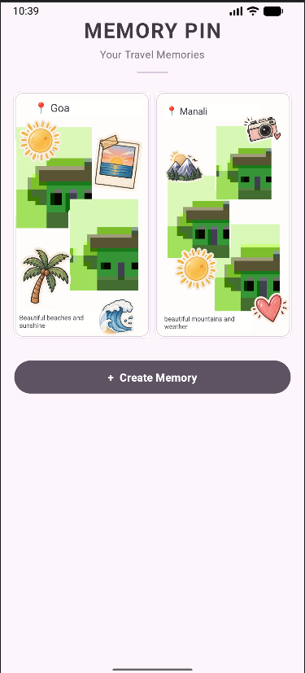
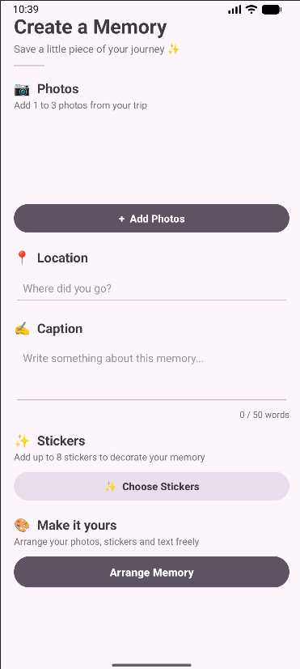
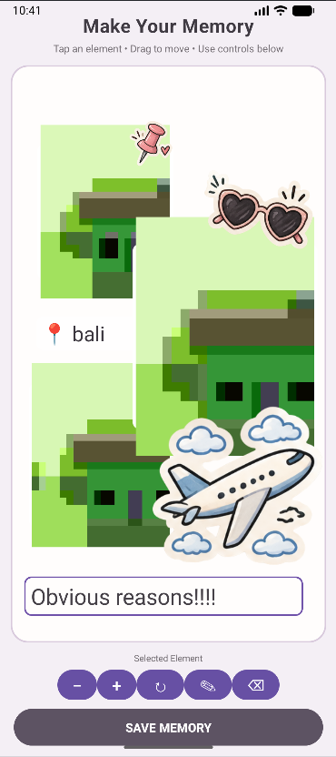

# 📍 Memory Pin

### A Scrapbook-Style Travel Memory App

Memory Pin is an Android application that allows users to create and save personalized travel memories using photos, locations, captions, and stickers.

Instead of storing travel photos as a simple gallery, Memory Pin lets users arrange their memories on a scrapbook-style canvas and create a unique visual memory for every trip.

---

## ✨ Features

- 📷 Select **1 to 3 photos** for a memory
- 📍 Add a **travel location**
- ✍️ Add a **caption** with a maximum of **50 words**
- ✨ Add up to **8 stickers**
- 🎨 Arrange photos, stickers, location and caption freely
- 👆 Drag elements around the scrapbook canvas
- 🔍 Resize selected elements
- 🔄 Rotate elements
- ✏️ Edit text elements
- 🗑️ Delete unwanted elements
- 💾 Save memories for later
- 📱 View saved memories in a scrapbook-style gallery
- 🔐 Photos are stored using app-private storage for reliable persistence

---

## 🎨 Main Screens

### 1. Home Screen

The home screen displays all saved travel memories in a clean three-column scrapbook-style gallery.

Users can create a new memory using the **Create Memory** button.

### 2. Create Memory

Users can enter the basic information for their memory:

- Photos
- Location
- Caption
- Stickers

After entering the details, the user can continue to the arrangement screen.

### 3. Arrange Memory

This is the main feature of Memory Pin.

Users can freely arrange their:

- Photos
- Stickers
- Location
- Caption

on a scrapbook-style canvas.

Elements can be moved, resized, rotated, edited, or deleted.

### 4. Saved Memories

Completed memories are saved and displayed on the home screen so that users can revisit their travel moments.

---

## 🛠️ Technologies Used

- **Android Studio**
- **Kotlin**
- **XML**
- **Android SDK**
- **ConstraintLayout**
- **FrameLayout**
- **GridLayout**
- **SharedPreferences**
- **JSON**
- **Android Activity Result API**
- **Android App Private Storage**

---

## 🏗️ Android Concepts Used

This project demonstrates practical understanding of Android application development, including:

- Activities
- Activity lifecycle
- Intents
- Activity Result API
- XML layouts
- View-based UI
- ConstraintLayout
- FrameLayout
- GridLayout
- ImageView
- TextView
- EditText
- Buttons
- ScrollView
- Event handling
- SharedPreferences
- JSON data storage
- App-private file storage
- Dynamic UI elements
- Touch and drag interactions

---
## 📱 Screenshots

### 1. Home Screen



### 2. Create Memory



### 3. Arrange Memory




---

## 📂 Project Structure

```text
Memory_pin/
│
├── app/
│   └── src/
│       └── main/
│           ├── java/
│           │   └── com/
│           │       └── meshwi/
│           │           └── memorypin/
│           │               ├── MainActivity.kt
│           │               ├── CreateMemoryActivity.kt
│           │               ├── ArrangeMemoryActivity.kt
│           │               └── StickerActivity.kt
│           │
│           ├── res/
│           │   ├── drawable/
│           │   ├── layout/
│           │   ├── mipmap/
│           │   └── values/
│           │
│           └── AndroidManifest.xml
│
└── README.md
